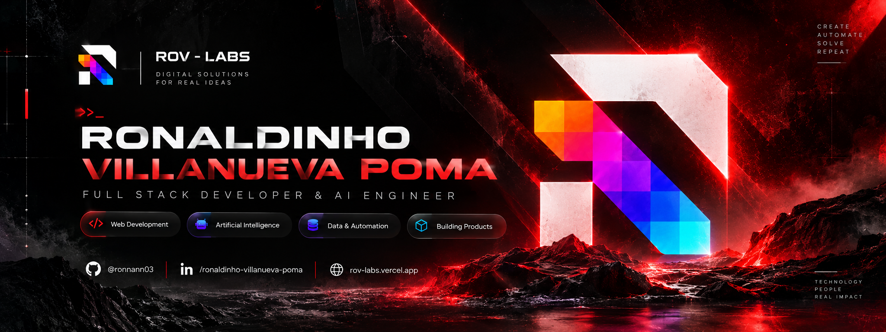

<!-- HEADER -->
<div align="center">



<br/>
<br/>


&nbsp;

&nbsp;

&nbsp;
[](https://rov-labs.vercel.app)
&nbsp;


</div>

---

```
// quien_soy.py ─────────────────────────────────────────────────────
```

```python
class Ronaldinho:

    nombre    = "Ronaldinho Villanueva Poma"           # 👤
    usuario   = "@ronnann03"                           # 💻
    ubicacion = "Perú 🇵🇪"                            # 📍
    carrera   = "Ingeniería de Sistemas"               # 🎓
    rol       = "Full Stack Developer & AI Engineer"   # 🧠
    estudio   = "Aprendiz constante"                   # 📚
    labs      = "ROV-Labs · rov-labs.vercel.app"       # 🚀

    superpoderes = [
        "🤖  IA Generativa & Prompt Engineering",
        "📊  Power BI & Análisis de Datos",
        "🗄️   Bases de Datos (SQL)",
        "📋  Gestión de Proyectos",
        "💻  Ofimática Nivel Intermedio",
        "🌐  Desarrollo Web",
    ]

    objetivo = "Aplicar IA y datos para resolver problemas reales"
    frase    = "Aprender, construir y mejorar — todos los días."
```

---

```
// habilidades.log ──────────────────────────────────────────────────
```

```
  ┌─────────────────────────────────────────────────────────────┐
  │  🤖  IA & PROMPT ENGINEERING                                │
  │                                                             │
  │  > IA Generativa / LLMs    [ ██████████████░░ ]  75%       │
  │  > Prompt Engineering      [ ██████████████░░ ]  75%       │
  │  > Python                  [ ████████░░░░░░░░ ]  50%       │
  │  > OpenAI / APIs           [ ██████░░░░░░░░░░ ]  45%       │
  │                                                             │
  ├─────────────────────────────────────────────────────────────┤
  │  📊  DATOS & BUSINESS INTELLIGENCE                          │
  │                                                             │
  │  > Power BI                [ ██████████████░░ ]  75%       │
  │  > SQL / Bases de Datos    [ ████████████░░░░ ]  65%       │
  │  > Análisis de Datos       [ ██████████░░░░░░ ]  60%       │
  │  > Jupyter Notebook        [ ████████░░░░░░░░ ]  50%       │
  │                                                             │
  ├─────────────────────────────────────────────────────────────┤
  │  🌐  DESARROLLO WEB                                         │
  │                                                             │
  │  > HTML / CSS              [ ██████████░░░░░░ ]  55%       │
  │  > JavaScript              [ ███████░░░░░░░░░ ]  45%       │
  │  > React                   [ █████░░░░░░░░░░░ ]  35%       │
  │                                                             │
  ├─────────────────────────────────────────────────────────────┤
  │  🧰  HERRAMIENTAS & GESTIÓN                                 │
  │                                                             │
  │  > Git / GitHub            [ ████████░░░░░░░░ ]  50%       │
  │  > VS Code                 [ ██████████████░░ ]  75%       │
  │  > Ofimática (Office)      [ ████████████░░░░ ]  65%       │
  │  > Gestión de Proyectos    [ ████████████░░░░ ]  65%       │
  └─────────────────────────────────────────────────────────────┘
```

---

```
// formacion.log ────────────────────────────────────────────────────
```

```
  ┌─────────────────────────────────────────────────────────────┐
  │                                                             │
  │  🎓  Ingeniería de Sistemas              [ 📖 En curso ]    │
  │  🤖  IA Generativa & Prompt Engineering  [ 📖 En curso ]    │
  │  📊  Power BI & Visualización de Datos   [ 📖 En curso ]    │
  │  🗄️   Bases de Datos                     [ 📖 En curso ]    │
  │  📋  Gestión de Proyectos                [ 📖 En curso ]    │
  │  💻  Ofimática                           [ ✅ Intermedio ]  │
  │                                                             │
  └─────────────────────────────────────────────────────────────┘
```

---

```
// aprendiendo_ahora.sh ──────────────────────────────────────────────
```

```bash
$ learning --topics

  >> LLMs y técnicas RAG          [ ██████░░░░ ]  60%  🔥
  >> Machine Learning             [ ████░░░░░░ ]  40%
  >> Prompt Engineering avanzado  [ ████████░░ ]  80%  🔥
  >> Full Stack Web Development   [ █████░░░░░ ]  50%
```

---

```
// proyectos.md ──────────────────────────────────────────────────────
```

<div align="center">

| 🚀 Proyecto | 📝 Descripción | 🔗 Enlace |
|:---|:---|:---:|
| **RideNow** | Plataforma de movilidad tipo ride-hailing pensada para el mercado peruano | [Ver repo](https://github.com/ronnann03?tab=repositories) |
| **Aivora** | SaaS para pequeños negocios de servicios en Latinoamérica, empezando por barberías | [Ver repo](https://github.com/ronnann03?tab=repositories) |
| **Tottem Hub** | Plataforma B2B para agencias de viajes escolares grupales en Perú | [Ver repo](https://github.com/ronnann03?tab=repositories) |
| **TourUp** | Turismo accesible con un grafo de conocimiento integrado a un bot de Telegram | [Ver repo](https://github.com/ronnann03?tab=repositories) |

<sub>Más proyectos y soluciones en 👉 <a href="https://rov-labs.vercel.app">rov-labs.vercel.app</a></sub>

</div>

---

```
// stats.github ──────────────────────────────────────────────────────
```

<div align="center">

[](https://github.com/ronnann03)

[](https://github.com/ronnann03)

[](https://github.com/ronnann03)

[](https://github.com/ronnann03)

</div>

---

```
// contacto.env ──────────────────────────────────────────────────────
```

```
  ╔══════════════════════════════════════════════════════════════════╗
  ║                  >_ ¡Conectemos y construyamos! 🤝              ║
  ╠══════╦═══════════════════════════════════════════════════════════╣
  ║ web  ║  rov-labs.vercel.app                                      ║
  ╠══════╬═══════════════════════════════════════════════════════════╣
  ║  @   ║  villanuevaronaldinho@gmail.com                          ║
  ╠══════╬═══════════════════════════════════════════════════════════╣
  ║  in  ║  linkedin.com/in/ronaldinho-villanueva-poma              ║
  ╠══════╬═══════════════════════════════════════════════════════════╣
  ║  ig  ║  instagram.com/foster_wk3                                ║
  ╠══════╬═══════════════════════════════════════════════════════════╣
  ║  fb  ║  facebook.com/ronayuw                                    ║
  ╠══════╬═══════════════════════════════════════════════════════════╣
  ║  wa  ║  +51 947 646 767                                         ║
  ╚══════╩═══════════════════════════════════════════════════════════╝
```

---

<div align="center">

```
░░░░░░░░░░░░░░░░░░░░░░░░░░░░░░░░░░░░░░░░░░░░░░░░░░░░░░░░░░░░░░░░░
   >_ Gracias por visitar mi perfil · ¡Sigamos en contacto! 🚀
   >_ Si algo te fue útil, deja una ⭐ — se lo agradezco mucho

░░░░░░░░░░░░░░░░░░░░░░░░░░░░░░░░░░░░░░░░░░░░░░░░░░░░░░░░░░░░░░░░░
```

</div>
